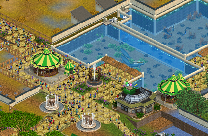
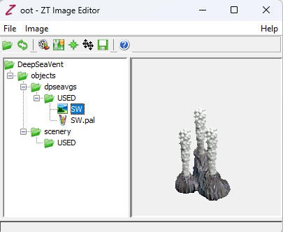
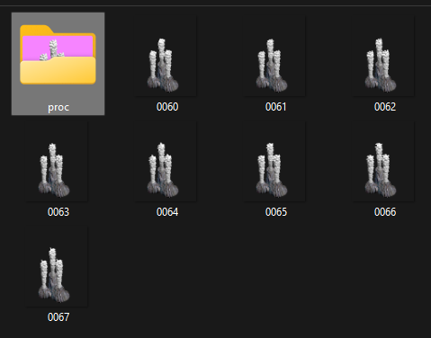
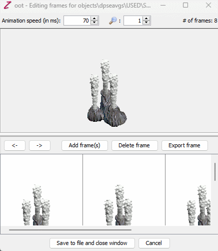
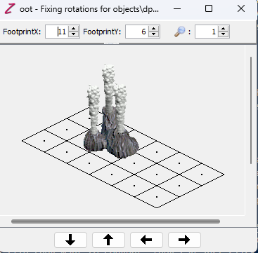

# Renovating Old Software

One of my nerdiest pastimes is to pick apart old games from the 90s or early 00s and see if I can create modern tools that would have helped the original developers or mod scene. A mod in this context is a modification to the game, such as a new level, character, or weapon. My latest project is to revamp the tools for the game Zoo Tycoon, released in the year 2001. It's a game where you build a zoo, make exhibits, place animals, and manage the business.

The game is easy to extract files from, but most of the file formats it uses are proprietary and were undocumented by the developers at the time. The main graphics format that displays the sprites doesn't even have a file extension, but luckily the modding community way back then was able to create software to open these graphics files and convert them to a more common format. The most popular software with this utility is called "Zoot".

There isn't a mockup or prototype to show for this project yet while I focus on developing other tools for the game, but until then it's a tool I rely on to make new animated sprites that the game could read.

In the early 00s, game studios weren't always known for their affinity toward any given modding community. Often what would happen is that a game would release without any modding tool support from the studio and the community would have to reverse engineer the game's file formats and create their own tools. This is the case with Zoo Tycoon, and Zoot is one of the tools that came out of that effort.

Many of its design decisions were likely experimental or influenced by software of its time. However, it does exercise some good usability principles. One of the things that immediately stood out to me was its prominent directory navigation on the left-hand pane--something which has largely been unchanging even down to modern software like Visual Studio Code, a text editor that programmers use to edit their projects. 

This is a great example of **recognition rather than recall**, [one of the ten usability guidelines for interface design](https://www.nngroup.com/articles/ten-usability-heuristics/). The user doesn't have to remember the exact path to the file they want to convert, they can just click on it and find the path at any time relying on the folder structure they're already familiar with.

As I mentioned, I use this tool largely to create graphics and animations for the game. Usually I start in Blender 3D, a 3D modeling software, and then export the frames to a series of images. I then use Zoot to convert these images to the game's proprietary format. 

However, I often have issue the productivity the software offers. For example, the software has a feature to add and delete individual frames, but no option to delete all frames at once. 

In the grand scheme of things though, it's not a bad tool and isn't actually very buggy. Since the proprietary format doesn't have import/export tools for other software, it's one of the only tools that can do what it does, which means I had to learn to use some of its more eccentric design choices. Not all are confusing.

The green compass, for example, brings up this window when clicked:

Here we can adjust the grid size and the graphic's position on the grid. Great example of a match between the system and the real world, [another usability guideline](https://www.nngroup.com/articles/ten-usability-heuristics/). The grid is also a common concept in graphic design, and the user can easily understand how to use it to position their graphic.

There are a few other buttons that are more or less what you'd expect. The folder icon opens up a new project, the recycle icon refreshes the current project, the film icon opens a new graphic, the question mark brings up the program instructions, and the floppy disk icon exports the proprietary graphics to `png`, a mainstream graphics format. There's also a strange double-compass icon in black that does pretty much the same thing as the compass icon, but the modifications that come from using it affect all frames and not just the one. The tools icon brings up the frames editor from earlier.

My main motivation for revamping this software later this year is to make it more user-friendly. I would start by hiding redundancies such as the one I just mentioned by combining features under one icon, adding a search tool that would make it easier to find graphics within a greater directory without having to navigate away from the main workspace, but mainly I'd like for there to be more error **prevention and recovery**.

Though the software isn't terribly buggy, what won't happen is when a directory isn't specified in a way that the program is designed to handle, it simply won't show any graphics at all nor will it display a message to let you know how to fix it. A few other small quality of life changes such as an option to delete all frames at once and a link to **documentation that shows how to use the software** would be nice.
